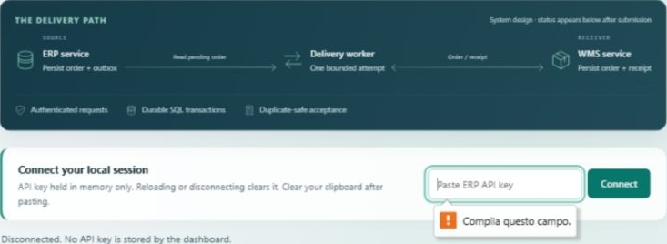
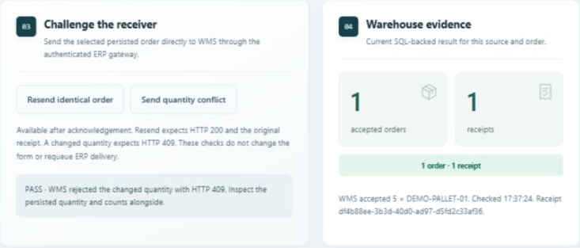
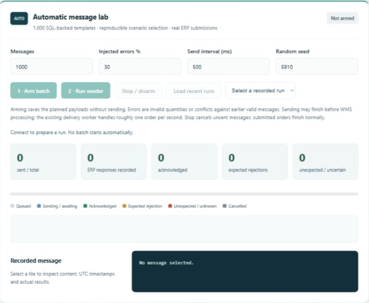
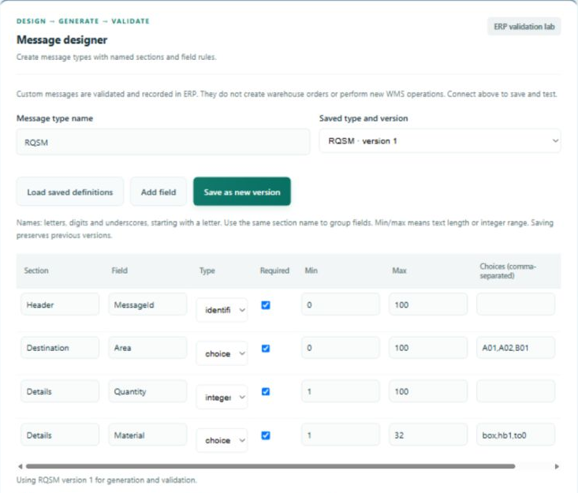
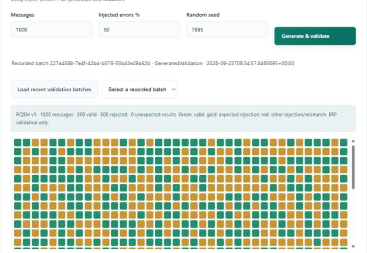

# Reliable ERP WMS dashboard user guide

Gianluca Barsaglini | MSIT 5910 | 24 September 2026

This guide explains how to connect to the local dashboard, verify an order, run an automatic batch, and design custom messages. It is intended for demonstration users who do not need to know SQL or C#.

### Choose the correct workflow

Order input and Automatic message lab exercise the ERP to WMS delivery path. ERP saves an order and an outgoing delivery record. A worker sends the request to WMS. WMS stores an accepted order and receipt; ERP then records the acknowledgement.

Message designer is an ERP validation lab. It checks custom message content against saved field rules and stores the results. A valid custom message does not create a warehouse order and is not a WMS acknowledgement.

### Before you begin

- Use the Windows development computer with the project at C:\Progetti\reliable-erp-wms.

- The SQL host MOBILE27 must be reachable on the configured network. RDP connectivity alone does not prove that SQL is reachable.

- Both services must be running. The dashboard is at http://127.0.0.1:5080/ on the development computer.

- Local encrypted configuration and database migrations must already be installed. Keep passwords and API keys out of screenshots and Git.

### About the screenshots

The screenshots show the implemented dashboard and results retained from the 23 September browser session. During preparation on 24 September, MOBILE27 was on another network and services could not become ready. These are captured examples, not a new live verification run. Identifiers and material codes are synthetic demonstration data.

Software baseline: cf248eb on feature/message-customization. Scroll to the named section if a navigation link is not visible in your version.

## Connect to the dashboard

The API key unlocks the dashboard. It is not your SQL password. The services use their own private database configuration.

### Start and open

Open PowerShell in the project directory. Run Start-Demo if the services are not running. Open-Dashboard opens the page and copies the dashboard key.

```powershell
cd C:\Progetti\reliable-erp-wms
powershell.exe -NoProfile -ExecutionPolicy Bypass -File .\scripts\Start-Demo.ps1
powershell.exe -NoProfile -ExecutionPolicy Bypass -File .\scripts\Open-Dashboard.ps1
```

- Click ERP API key, paste with Ctrl+V, and click Connect.

- A successful connection shows an authenticated local session and enables actions.

- Clear the clipboard after pasting. Refreshing or selecting Disconnect clears the tab key; reconnect when needed.



Figure 1. Connection panel and delivery path. The browser requires a key before Connect can proceed.

ExecutionPolicy Bypass applies only to the launched PowerShell process. If a demo port is occupied, use scripts/Stop-Demo.ps1 to stop the tracked processes before restarting. Do not start a second demo over the existing one.

## Submit an order and verify its outcome

- Connect, scroll to Order input and click New order.

- Enter a SKU such as DEMO-PALLET-01 and a quantity from 1 to 100000. Keep the generated Order ID and Correlation ID.

- Click Submit to ERP. Pending means saved, but not yet confirmed by WMS.

- Wait for Acknowledged. Use Refresh evidence if needed; automatic pending refresh stops after about 30 seconds.

- Read Warehouse evidence. Expect one accepted order and one receipt for a successful fresh order. Compare the receipt with the ERP decision.



Figure 2. Recorded evidence with one order and one receipt after a quantity conflict was rejected.

### Check duplicate protection

Resend identical order should return HTTP 200 and the original receipt. Send quantity conflict should return HTTP 409 while the original quantity and counts remain unchanged. These buttons test the selected acknowledged order through the gateway; they do not requeue ERP delivery.

Request & response shows actual HTTP bodies. Select a history row to inspect that exchange. HTTP 202 confirms ERP persistence, not warehouse acceptance. RecoveryRequired means the delivery outcome is uncertain and needs investigation.

## Run an automatic order batch

Automatic message lab uses 1000 SQL-backed templates for real order submissions. Start with 10 messages, 30 percent injected errors, 500 ms between sends, and seed 5910.

- Click 1 Arm batch. This saves the plan without sending.

- Click 2 Run sender. Counters and tiles update as messages progress.

- Wait through Draining until submitted orders reach terminal outcomes. Warehouse processing can take longer than sending.

- Select a tile for its payload, response, receipt, timestamps and expected outcome. Load recent runs reopens saved evidence.



Figure 3. Sender controls before arming. Buttons are disabled here because the session is disconnected.

Gray is queued, blue is sending or awaiting delivery, green is acknowledged, gold is an expected rejection, and red is unexpected or uncertain. Stop cancels unsent work; submitted orders finish normally. Intentional invalid quantities and conflicts are controlled test cases, not real-world failure-rate estimates.

## Design a custom message type

The RQSM example contains a Header identifier, a Destination area, and Details fields for quantity and material. Reusing a section name groups its fields together.

- Enter a case-sensitive type name of up to 40 letters, digits or underscores, starting with a letter.

- Use Add field for up to 24 fields. Set section, name, type and Required.

- Text Min and Max are length limits. Integer Min and Max are number bounds. Choice uses comma-separated values. Boolean means true or false; identifier requires a nonempty GUID. Other types ignore Min and Max.

- Click Save as new version. Saving the same name creates the next immutable version; old evidence retains its original rules.



Figure 4. RQSM version 1 groups four fields into three sections. Example material choices are box, hb1 and to0.

Required fields cannot be omitted. Optional fields may be omitted, but a present null value is invalid. Unsaved edits disable generation and validation until saved. Selecting a saved definition replaces the editor contents.

## Generate custom data and inspect results

- Select a saved type and version. Choose 1 to 1000 messages, 0 to 80 percent injected errors, and an integer seed.

- Click Generate & validate. ERP generates the batch, evaluates it and saves the evidence in SQL.

- Select a tile to inspect content and results. ActualValid is the observed result; Matched compares it with the expected validity.



Figure 5. Captured RQSM batch with 1000 messages, 500 valid, 500 rejected and zero unexpected results at 50 percent injection.

Green means valid; gold is an intentional rejection; red indicates a mismatch or a rejected manual message. The first injection mode replaces one field with null. This is a validation fault, not a network error.

Edit Message content as valid JSON and click Validate edited message & record to test your own input. The saved version shown above applies. Manual checks have no predetermined expected result. Editing text does not change a recorded result until another validation is performed.

Load recent validation batches retrieves the latest 20 batches for your source and restores the selected definition version. Seeds repeat business values and fault positions; generated GUIDs remain new.

## Troubleshooting and demonstration checklist

### When a connection fails

- ERP unavailable or page unreachable: first confirm MOBILE27 is reachable on the configured SQL network, then run Start-Demo. A cached page is not proof of running services.

- Connect blocked or authentication error: run Open-Dashboard again, paste the copied key and reconnect. Do not enter SQL credentials.

- Disabled actions: check the connection. Custom validation also requires a saved definition without unsaved edits.

- Draining: allow time for the outbox worker. A 1000-message order batch can take many minutes; begin with 10.

- Custom rejection: inspect the field path and issue code. Check required fields, section shape, types, bounds, choices and unknown fields.

- Uncertain delivery: inspect the existing order ID and WMS evidence before creating a new identity. Terminal failures do not automatically recover in this milestone.

### Suggested demonstration sequence

- Connect and explain the ERP to WMS path.

- Submit an order; verify one warehouse order and one receipt.

- Resend the order, then challenge it with a changed quantity.

- Run 10 automatic messages with 30 percent intentional errors.

- Save a custom type, generate a batch, and inspect valid and rejected results.

### Evidence and limits

The implementation checkpoint passed 44 unit tests and 60 HTTP/SQL assertions before this documentation session. They cover validation, versions, generated outcomes, source isolation and the existing order flow. They were not rerun with MOBILE27 on a different network.

Custom types support independent scalar fields in named sections. Repeating lists, related-field rules, additional warehouse handlers and custom delivery tracking remain future work. Use synthetic data and never publish local credentials.
